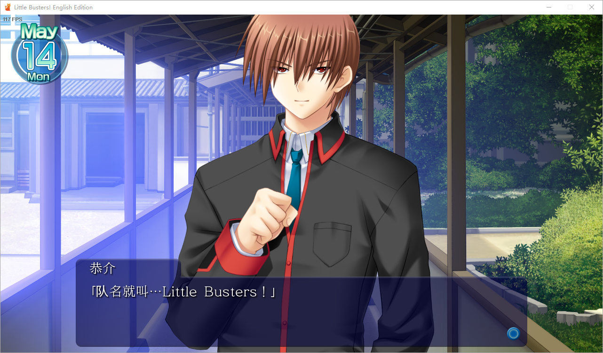

# LBEE_TranslationPatch  
## Little Busters English Edition 汉化程序

通过参考[LuckSystem](https://github.com/wetor/LuckSystem)和[lbee-utils](https://github.com/G2-Games/lbee-utils)编写

可参考的翻译位于[TranslationText/LB_EX_Unicode](TranslationText/LB_EX_Unicode)  
待翻译的文本位于[TextMapping](TextMapping), 此文件夹下的Json会被程序导入到游戏内
[Release页面](https://github.com/Jack-Myth/LBEE_TranslationPatch/releases)有一个或许对填写文本有帮助的小工具

前往[Release页面](https://github.com/Jack-Myth/LBEE_TranslationPatch/releases)下载已编译的汉化程序  
将LBEE的主程序拖到LBEE_TranslationPatch.exe上即可执行汉化流程

目前汉化还远未完成，可能存在疏漏或错误，可以帮忙填一填[汉化文本](TextMapping)吖！
